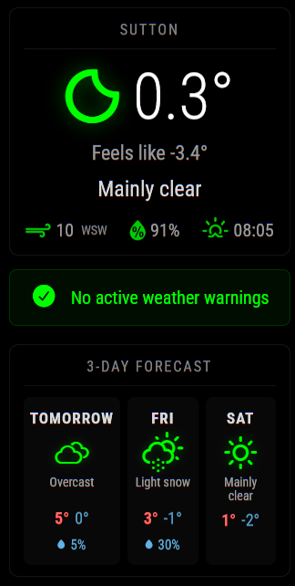

# MMM-SevereWeatherAlerts

A MagicMirror² module that displays **severe weather warnings** and alerts with a 3-day forecast outlook.



## Features

- 🚨 **Severe Weather Warnings** - Displays active weather alerts with severity levels (Red/Amber/Yellow)
- 🌍 **Global Coverage** - Uses Open-Meteo API (no API key required) for worldwide weather data
- 🇬🇧 **Met Office Support** - Optional integration with Met Office DataHub API for enhanced UK coverage
- 📅 **3-Day Forecast** - Shows weather outlook with visual indicators for days with warnings
- 🎨 **Emergency Broadcast Aesthetic** - Bold, attention-grabbing warning display
- 📱 **Responsive Design** - Supports both standard and compact display modes
- 🔄 **Auto-rotating Display Support** - Works with rotated portrait displays

## Alert Types Detected

The module analyzes weather data and generates warnings for:

- ⛈️ **Thunderstorms** - Lightning and heavy rain
- 🌨️ **Heavy Snow** - Significant snowfall
- 🌧️ **Heavy Rain** - Potential flooding
- 💨 **High Winds** - Strong sustained winds or gusts
- 🌫️ **Dense Fog** - Reduced visibility

## Installation

### 1. Clone this repository

```bash
cd ~/MagicMirror/modules
git clone https://github.com/syntosys-101/MMM-SevereWeatherAlerts.git
```

### 2. No dependencies required!

The module uses built-in Node.js modules only.

## Configuration

Add to your `config/config.js`:

```javascript
{
    module: "MMM-SevereWeatherAlerts",
    position: "top_right",  // or any position
    config: {
        latitude: 51.5074,         // Your latitude
        longitude: -0.1278,        // Your longitude
        location: "London",        // Display name
        updateInterval: 600000,    // 10 minutes
        showForecast: true,
        forecastDays: 3,
        units: "metric",           // or "imperial"
        rotated: false             // Set true if display is rotated
    }
}
```

### Configuration Options

| Option | Default | Description |
|--------|---------|-------------|
| `latitude` | `51.5074` | Your location latitude |
| `longitude` | `-0.1278` | Your location longitude |
| `location` | `"London"` | Display name for your location |
| `updateInterval` | `600000` | Update interval in ms (10 min default) |
| `showForecast` | `true` | Show 3-day forecast below alerts |
| `forecastDays` | `3` | Number of forecast days (1-7) |
| `units` | `"metric"` | Temperature units: `"metric"` or `"imperial"` |
| `language` | `"en"` | Language for date formatting |
| `rotated` | `false` | Set `true` if your display is rotated 90° |
| `compactMode` | `false` | Smaller display for narrow panels |
| `showNoAlertsMessage` | `true` | Show message when no alerts active |
| `metOfficeApiKey` | `null` | Optional: Met Office DataHub API key |

### Finding Your Coordinates

1. Go to [Google Maps](https://maps.google.com)
2. Right-click on your location
3. The coordinates will appear at the top of the menu

## Met Office API (Optional - UK Only)

For enhanced UK weather warnings, you can optionally use the Met Office DataHub API:

1. Register at [Met Office DataHub](https://datahub.metoffice.gov.uk/)
2. Subscribe to the free "Site-specific" API
3. Add your API key to the config:

```javascript
config: {
    metOfficeApiKey: "your-api-key-here",
    // ... other options
}
```

**Note:** The module works perfectly without the Met Office API - it will analyze Open-Meteo weather data to detect severe conditions.

## Example Configurations

### Standard Display (Top Right)

```javascript
{
    module: "MMM-SevereWeatherAlerts",
    position: "top_right",
    config: {
        latitude: 53.4808,
        longitude: -2.2426,
        location: "Manchester"
    }
}
```

### Compact Mode (Side Panel)

```javascript
{
    module: "MMM-SevereWeatherAlerts",
    position: "top_left",
    config: {
        latitude: 55.9533,
        longitude: -3.1883,
        location: "Edinburgh",
        compactMode: true,
        forecastDays: 2
    }
}
```

### Rotated Display (Portrait Mode)

```javascript
{
    module: "MMM-SevereWeatherAlerts",
    position: "bottom_bar",
    config: {
        latitude: 51.4545,
        longitude: -2.5879,
        location: "Bristol",
        rotated: true
    }
}
```

### With Matrix Rain Background

Works great alongside [MMM-MatrixRain](https://github.com/syntosys-101/MMM-MatrixRain):

```javascript
{
    module: "MMM-MatrixRain",
    position: "fullscreen_below",
    config: { rotated: true }
},
{
    module: "MMM-SevereWeatherAlerts",
    position: "top_right",
    config: {
        latitude: 51.5074,
        longitude: -0.1278,
        location: "London",
        rotated: true
    }
}
```

## Alert Severity Levels

| Level | Colour | Description |
|-------|--------|-------------|
| **Red** | 🔴 | Extreme weather - Take action |
| **Amber** | 🟠 | Severe weather - Be prepared |
| **Yellow** | 🟡 | Weather awareness - Be aware |

## Troubleshooting

### Module not loading
- Check the browser console (F12) for errors
- Ensure the module folder is named exactly `MMM-SevereWeatherAlerts`

### No weather data
- Verify your latitude/longitude are correct
- Check your internet connection
- The Open-Meteo API may have temporary issues

### Alerts not appearing
- The module only shows alerts when severe weather is detected
- Try setting your coordinates to a location with current severe weather to test

## Credits

- Weather data provided by [Open-Meteo](https://open-meteo.com/)
- Optional UK data from [Met Office](https://www.metoffice.gov.uk/)

## License

MIT License - see [LICENSE](LICENSE) file
